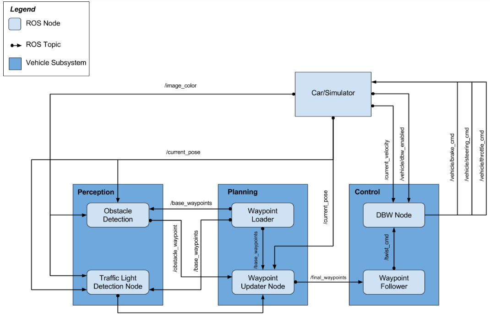

# CarND-Capstone-Project
[](http://www.udacity.com/drive)

The System Integration project is the final project of the Udacity Self-Driving Car Engineer Nanodegree. The software architecture is showed below:

*Note: For this project, the obstacle detection node is not implemented*




## Perception Subsystem

There are two nodes in this subsystem, the `Obstacle Detection Node` and the `Traffic Light Detection Node`, in this project, only the `Traffic Light Detection Node` needs to be completed.

The `Traffic Light Detection Node` subscribes to four topics:

* `/base_waypoints` provides the complete list of waypoints for the course.
* `/current_pose` can be used to determine the vehicle's location.
* `/image_color` provides an image stream from the car's camera. These images are used to determine the color of upcoming traffic lights.
* `/vehicle/traffic_lights` provides the (x, y, z) coordinates of all traffic lights

The Traffic Light Detection Node is divided into two parts, the first part is used to detect the state of the traffic lights in the picture captured by the camera, which is completed in `tl_classifier.py`, the second part find the nearest visible traffic light ahead of the vehicle, which is completed in `tl_detector.py`

### Traffic Light Classification

We use the TensorFlow Objection Detection API to detect and classify the traffic light. We do the detection and classification in one stage. 

### Traffic Light Detection

Since the exact location of the traffic lights and parking lines is deterministic, we don't need to be constantly detecting traffic lights. When the traffic signal is far away from us, there is no need to detect the traffic signal. Only when the traffic signal is within the distance we set (200 waypoints), the detection model starts to detect. When the red light is detected, the car will decelerate， and stop before the stop line. When the green light is detected, the car continues to move forward.

## Plan Subsystem

The Waypoint Updater Node is in this subsystem, we complete this node by two stages:

At the first stage, we only consider that the car can follow the way but igoring the traffic light. In callback function 'waypoints_cb' and `pose_cb`, we can get all way points and car's position. Then we use function `closest_waypoint` to search the closest point ahead the car in waypoints, then we pass 200 points ahead this closest point as the final waypoints, namely, the car's next path point. And the velocity of all final points are set to be reference speed `40kPh`.

The second stage is that when the traffic light detector is ready for working, we subscribe ros' message `/traffic_waypoint` to get the the stop line point index in waypoints. Then we modify the `pose_cb` function, the mainly change is modify the velocity of some points in final waypoints. It let the car can decelerate to zero velocity before the stop line position.


## Control Subsystem

The DBW Node is in this subsystem, the functionality of this node is controlling the car follows the final way points' setting velocity. In this node, we use the final setting twist velocity (linear velocity and angular velocity) as the input, then output the throttle value, steering angle and brake value. The main implementation of this can be found in the class `Controller`. In this class, we use PID controller to get the corresponding throttle value and brake value, use YawController to get the corresponding steer angle.All details can be found in `dbw_node.py` and `twist_controller.py`.

## Installation

### Native Installation

* Be sure that your workstation is running Ubuntu 16.04 Xenial Xerus or Ubuntu 14.04 Trusty Tahir. [Ubuntu downloads can be found here](https://www.ubuntu.com/download/desktop).
* If using a Virtual Machine to install Ubuntu, use the following configuration as minimum:
  * 2 CPU
  * 2 GB system memory
  * 25 GB of free hard drive space

  The Udacity provided virtual machine has ROS and Dataspeed DBW already installed, so you can skip the next two steps if you are using this.

* Follow these instructions to install ROS
  * [ROS Kinetic](http://wiki.ros.org/kinetic/Installation/Ubuntu) if you have Ubuntu 16.04.
  * [ROS Indigo](http://wiki.ros.org/indigo/Installation/Ubuntu) if you have Ubuntu 14.04.
* [Dataspeed DBW](https://bitbucket.org/DataspeedInc/dbw_mkz_ros)
  * Use this option to install the SDK on a workstation that already has ROS installed: [One Line SDK Install (binary)](https://bitbucket.org/DataspeedInc/dbw_mkz_ros/src/81e63fcc335d7b64139d7482017d6a97b405e250/ROS_SETUP.md?fileviewer=file-view-default)
* Download the [Udacity Simulator](https://github.com/udacity/CarND-Capstone/releases).

### Docker Installation

[Install Docker](https://docs.docker.com/engine/installation/)

Build the docker container

```bash
docker build . -t capstone
```

Run the docker file

```bash
docker run -p 4567:4567 -v $PWD:/capstone -v /tmp/log:/root/.ros/ --rm -it capstone
```

### Port Forwarding

To set up port forwarding, please refer to the [instructions from term 2](https://classroom.udacity.com/nanodegrees/nd013/parts/40f38239-66b6-46ec-ae68-03afd8a601c8/modules/0949fca6-b379-42af-a919-ee50aa304e6a/lessons/f758c44c-5e40-4e01-93b5-1a82aa4e044f/concepts/16cf4a78-4fc7-49e1-8621-3450ca938b77)

### Usage

1. Clone the project repository

```bash
git clone https://github.com/udacity/CarND-Capstone.git
```

2. Install python dependencies

```bash
cd CarND-Capstone
pip install -r requirements.txt
```

3. Make and run styx

```bash
cd ros
catkin_make
source devel/setup.sh
roslaunch launch/styx.launch
```
